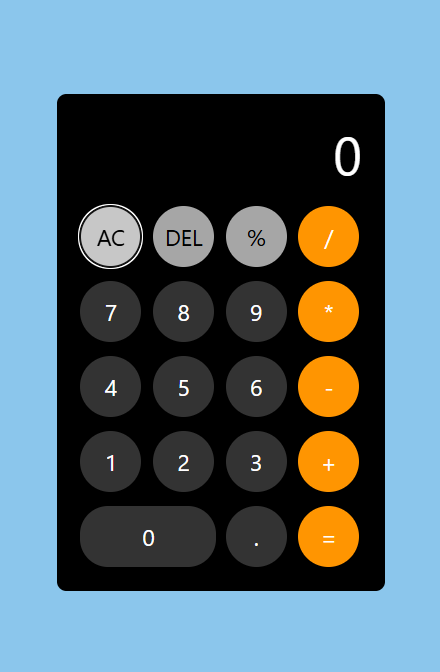

# 📱 Modern & Secure JS Calculator

A sleek, robust, and highly responsive web-based calculator built with clean **Vanilla JavaScript (ES6+)**, **HTML5**, and **CSS3**. Engineered with a focus on strict input validation, security, and exceptional user experience by eliminating common logical bugs found in standard web calculators.

---

## 🚀 Live Demo

## 🔗 **[Launch Live Project](https://5nour.github.io/Simple-Calculator/)**

## ✨ Key Features & Logical Guardrails

Unlike typical basic calculators, this project implements advanced state-handling and input sanitization to ensure seamless performance:

- **🔒 Secure Computation:** Replaced the unsafe and vulnerable `eval()` function with a secure, sandboxed execution method to prevent script injection.
- **🎯 Smart Decimal Protection:** Implements context-aware checking to prevent multiple decimals within a single operand (e.g., blocks inputs like `5.5.5`).
- **🛡️ Divison-by-Zero Protection:** Gracefully traps division-by-zero errors, returning a clean `Error` message instead of breaking the UI with `Infinity` or `NaN`.
- **📐 Auto-Precision (Floating Point Fix):** Prevents display overflow by rounding complex decimal fractions (like `1/3`) up to a clean, maximum of 4 decimal places using dynamic precision-trimming.
- **📱 Fully Responsive & Fluid:** Built with CSS Grid and Flexbox, ensuring a native-app feel on all devices from mobile screens to high-res monitors.
- **🧹 Smart State Clearing:** Context-aware backspacing (`DEL`) and all-clear (`AC`) commands that intelligently reset the system memory.

---

## 🛠️ Tech Stack & Concepts Demonstrated

- **HTML5:** Semantic structuring and accessible layout.
- **CSS3:** Flexbox, CSS Grid, Custom Variables (for theme scalability), and modern layout properties.
- **JavaScript (ES6+):**
  - Dynamic Event Listeners & DOM manipulation.
  - Secure execution functions (`Function` constructor).
  - Regular Expressions (Regex) for input parsing and string replacement.
  - Advanced array manipulations and state-checking methods.

---

## 📸 Preview

---

## 🚀 Roadmap (Upcoming Enhancements)

This project is actively maintained. Upcoming milestones include:

- [ ] **Interactive History Log:** Save past calculations locally using `localStorage` so users can retrieve and reuse previous results.
- [ ] **Customizable Themes:** A color picker engine allowing users to dynamically customize the calculator's appearance.
- [ ] **Voice-Activated Calculations:** Integrating the Web Speech API for hands-free calculations.

---

## 📄 License

This project is open-source .

## 👨‍💻 Author

Nour Eldean Tamer
